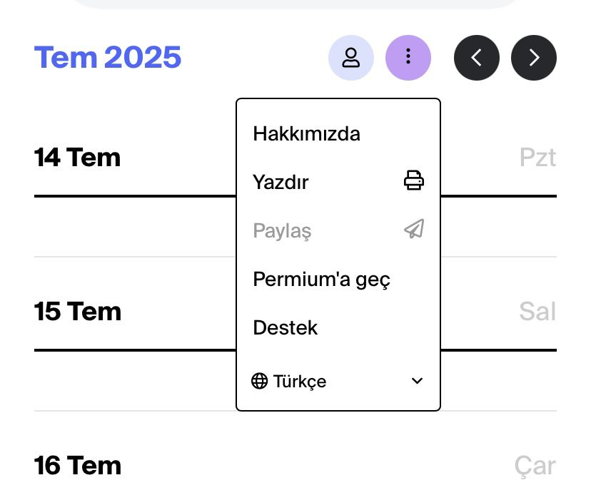
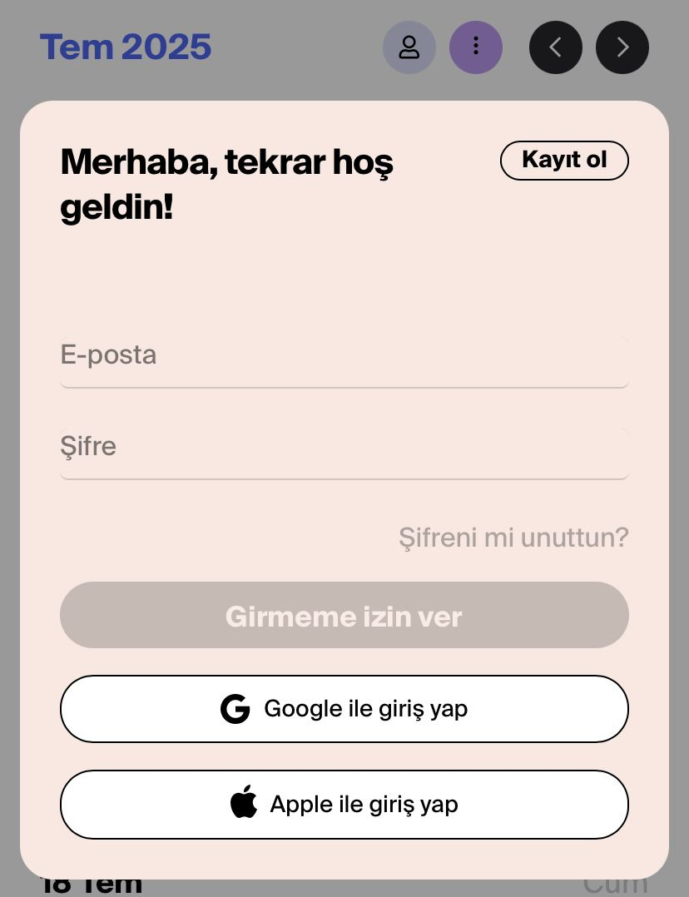
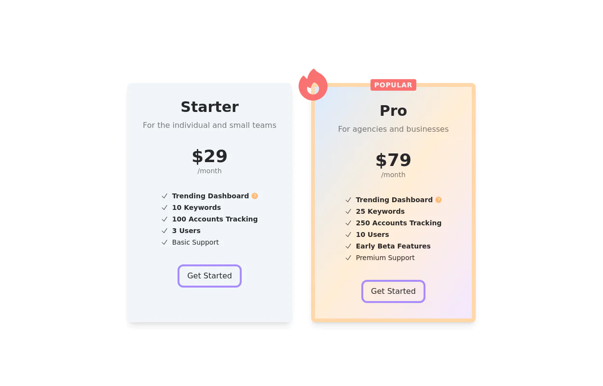

# Takvim Projesi

- Fatma Aksakal : Header kısmındaki menü üzerine tıklayınca menü sekmeleri oluşuyor. bunları tanımlanamanı rica ediyorum . Görsel olarak aşağıda paylaşacağım. İçeriği diğer arkadaşlar yapacak. Sen sadece tanımlayıp , onların web linklerini koymaya hazır şekilde yapmanı rica ediyorum.

Proje gorseli []

---

- Mehmet Akgedik : Senden ricam header kısmındaki kişi butonuna tıklanınca form sekmesinin açılması ve kullanıcının onu doldurarak alttındaki sekmelere bağlanması. Görselini paylaşacağım. Bakarak aynısını yapabilirsin. Burada js kullanman gerebilir . 

Proje Görseli []
---
- Umut Hastürk : Senden ricam, Fatma'nın yaptığı menü sekmesindeki "Hakkımızda" kısmını tanımlaman. Bir tane profil bilgilerinin olduğu ad/soyad/yaşadığı yer/hobiler gibi kısımların olduğu bir sayfa tasarlayıp (tek sayfalık basit web sitesi ama eklemek istediklerini ekleyebilirsin, senin hayal dünyada bırakıyorum) [https://www.netlify.com/] sitesi üzerinden yaptığın projeyi web sitesine dönüştürüp , hakkımızda yazan navbara tanımlaman. Takıldığın yerde sor, yardımcı olurum.
---

- Özcan Aydoğan : Senden ricam, Umutun yaptığına benzer olarak menü sekmesinde "Permium'a geç" butonunu tanımlaman . Premium için, içinde flyat ve özellik olan kartlar oluşturman. Tailwind css de kartlar oluşturmuştuk. [https://tailwindcss.com/] buradaki flex yapılarına bakarak fikir sahibi olabilirsin. Aşağıda fikir sahibi olman için görsel paylaşacağım. Bu yaptığın web sitesini [https://www.netlify.com/] tanımlayıp, menüdeki Premium'a geç sekmesine tanımlaman gerekir. Takıldığın yerde sorabilirsin.
 []
 ---

-  Özkan : Senden ricam aynı menüdeki "Destek" kısmı için tanımlaman. İçeriğini senin hayal gücüne ve araştırmana bırakıyorum. Sende bu hazırladığın web sayfasını 
[https://www.netlify.com/] kullanarak web linkini alıp "Destek" sekmesine tanımlaman gerekiyor. Takıldığın yerde sorabilirsin. 
